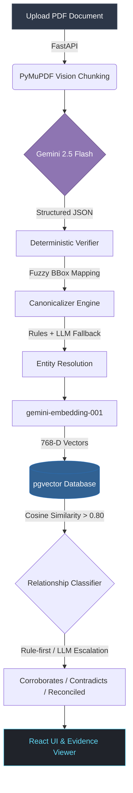

<div align="center">

# 🌐 Fact Knowledge Layer
**Next-Generation Financial Fact Extraction & Reconciliation Engine**

[](https://fastapi.tiangolo.com)
[](https://reactjs.org/)
[](https://www.postgresql.org/)
[](https://deepmind.google/technologies/gemini/)
[](https://www.docker.com/)
[](https://tailwindcss.com/)

An end-to-end AI-powered pipeline that extracts, canonicalizes, and cross-references facts from dense PDF documents. It autonomously builds a knowledge graph to identify if facts across documents **corroborate**, **contradict**, or **reconcile** with one another.

</div>

---

## 🚀 Setup and Run Instructions

**Prerequisites:**
- `Docker` (for PostgreSQL + pgvector)
- `Python 3.9+`
- `Node.js 18+`

**1. Database Initialization**
Start the PostgreSQL container equipped with the `pgvector` extension:
```bash
docker-compose up -d
```

**2. Core Engine (Backend) Setup**
Open a terminal and navigate to the project root:
```bash
# Create and activate an isolated Python environment
python3 -m venv venv
source venv/bin/activate

# Install core dependencies
pip install -r requirements.txt

# Set up your environment variables
# Create a .env file in the root directory and inject your API key:
# GEMINI_API_KEY=your_gemini_api_key_here

# Ignite the FastAPI server
cd backend
uvicorn main:app --reload
```

**3. Client Interface (Frontend) Setup**
Open a secondary terminal and navigate to the frontend directory:
```bash
cd frontend
npm install
npm run dev
```
Navigate to `http://localhost:5173` in your browser to access the control center.

---

## 🎥 Video Demo

[👉 **Watch the 3-minute Demo Video Here**](https://drive.google.com/file/d/1sG07XTFjJtlB7hRLWGoLFcNc_26McbYW/view?usp=drive_link)

*In this transmission, we demonstrate the autonomous ingestion of a financial document, the real-time processing pipeline, and the resolution of the four required edge cases: a corroborated fact, a genuine contradiction, a reconciled contradiction, and a handled extraction failure.*

---

## 🧠 Approach

### Architecture & Workflow

We engineered a robust 4-phase pipeline bridging a **FastAPI/Python** neural backend with a **React/Vite** frontend interface, entirely persisted in **PostgreSQL (`pgvector`)**.



1. **Parser & Extractor**: Utilizes `PyMuPDF` to spatially chunk documents and extract bounding boxes. `Gemini 2.5 Flash` strictly outputs Pydantic JSON schemas. A deterministic verification layer uses `rapidfuzz` to guarantee the LLM's `evidence_text` genuinely exists in the source block, eliminating hallucinated facts.
2. **Canonicalizer**: A rule-first transformation engine normalizes currencies (e.g., "Rs. 8,142 Cr" -> "81420000000 INR") and temporal contexts. Entity resolution relies on deterministic string mapping, escalating to the LLM solely as a fallback.
3. **Matcher & Classifier**: Generates high-density embeddings via `gemini-embedding-001`. `pgvector` executes ultra-fast cosine similarity searches (>0.80). Classification relies on hard logic (exact numeric/time matches = `CORROBORATES`), while semantic conflicts escalate to the LLM for `CONTRADICTS` or `RECONCILED` reasoning.

### Important Decisions & Trade-offs
* **Rule-First over LLM-First**: To optimize latency, reduce API costs, and completely neutralize hallucinations, we enforced hardcoded algorithms for canonicalization and classification *before* escalating to the LLM. 
* **Throttling vs. Speed**: Operating on the Free Tier of the Gemini API (strict 15 RPM limit) necessitated synchronous `time.sleep()` delays in our background workers. We intentionally traded processing velocity for pipeline stability to prevent `429 RESOURCE_EXHAUSTED` cascades.

---

## 🚧 Limitations and Next Steps

**What does not work yet (Limitations):**
* **Free-Tier Bottlenecks**: Ingesting massive 400-page prospectuses sequentially is currently sluggish due to our self-imposed throttling. The pipeline respects the 15 RPM free-tier limit to guarantee stability.
* **Complex Table Parsing**: While `PyMuPDF` handles standard text flawlessly, extracting deeply nested or merged cells from complex financial matrices occasionally fractures the `evidence_text` bounding boxes.

**What we would build next:**
* **Asynchronous Task Mesh**: Replace the current `BackgroundTasks` architecture with `Celery` and `Redis` to distribute document chunk processing across multiple parallel worker nodes.
* **Vision-Language Models (VLMs) for Tables**: Integrate specialized OCR or VLM models (e.g., Table-Transformer) to elevate extraction precision from high-density financial tables.
* **Frontend Virtualization**: Implement DOM virtualization (e.g., `tanstack-virtual`) in the Fact Explorer to sustain 60fps rendering when navigating tens of thousands of facts.

---

## 📡 Additional Notes

* **Sub-Pixel Precision Highlighting**: The Evidence Viewer maps the exact coordinate space of the LLM's extracted text back to the rendered PDF image using dynamic `fitz` point-to-pixel conversion algorithms.
* **Graceful Degradation**: If the LLM hallucinates an `evidence_text` that cannot be mapped to the source document, the system catches it deterministically, flags the fact as `unverified` (Red Shield in the UI), and aggressively quarantines it from polluting the downstream relationship classification graph.
